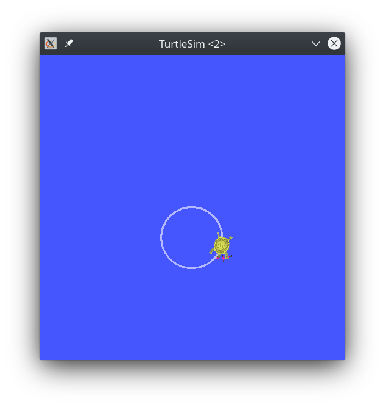
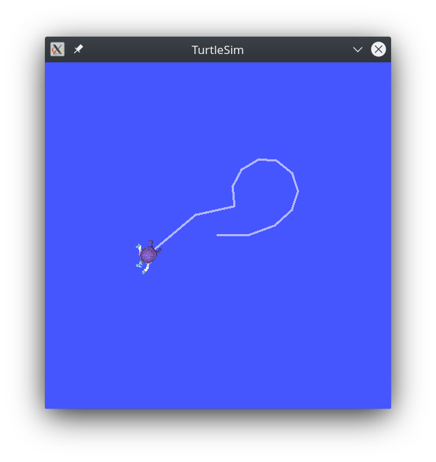
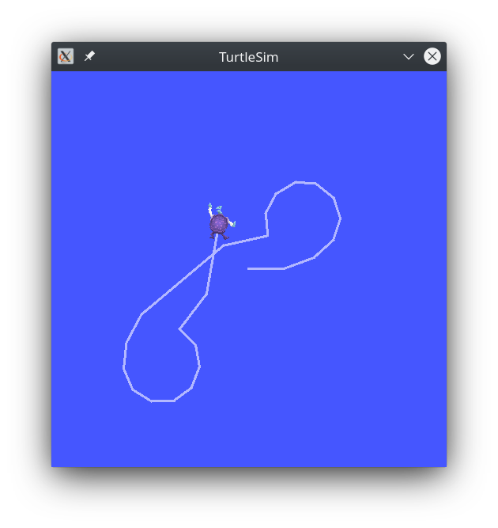

# Other Common Tools in ROS2
In this tutorial we'll cover some of the other common tools used in ROS2 development. These include the **rqt_console** plugin, **Launch files**, and the **ROS Bag System**.

## rqt_console
`rqt_console` is a GUI tool used to introspect log messages in ROS 2. Nodes use logs to output messages concerning events and statuses in a variety of ways. Their content is usually informational, for the sake of the user. The intent of a log message is defined by the author of the node, though the content may be written at runtime.

Typically, log messages show up in your terminal. With `rqt_console`, you can collect those messages over time, view them closely and in a more organized manner, filter them, save them and even reload the saved files to introspect at a different time.

In this section, we'll view some log messages generated by `turtlesim`, you should bring up both the main node and the teleop node:
```
ros2 run turtlesim turtlesim_node
ros2 run turtlesim turtle_teleop_key
```
### Logger Levels
Before we jump into using `rqt_console` to view log messages, we'll need an understanding of *Logger Levels* in ROS2. Logger Levels are a way of organizing the output of a program into increasingly important/severe categories. This helps prevent your terminal windows from being cluttered with needless debug messages, and elevate important messages like warning and errors.

ROS2’s Logger Levels are ordered by severity:
- `Fatal` messages indicate the system is going to terminate to try to protect itself from detriment.
- `Error` messages indicate significant issues that won’t necessarily damage the system, but are preventing it from functioning properly.
- `Warn` messages indicate unexpected activity or non-ideal results that might represent a deeper issue, but don’t harm functionality outright.
- `Info` messages indicate event and status updates that serve as a visual verification that the system is running as expected.
- `Debug` messages detail the entire step-by-step process of the system execution.

The default level is `Info`. You will only see messages of the default severity level and more-severe levels. For example, if you set the default level to `Warn`, you would only see messages of severity `Warn`, `Error`, and `Fatal`.

You can set the default Logger Level by setting the node argument on launch. For example, if you wanted to launch the turtlesim node with a default Logger Level of `Warn`, you would launch the node with the following arguments (making sure you close any existing instance of the node):
```
ros2 run turtlesim turtlesim_node --ros-args --log-level WARN
```
Now you won’t see the initial `Info` level warnings that came up in the console last time you started turtlesim.

### Using rqt_console
Start `rqt_console` in a new terminal with the following command:
```
ros2 run rqt_console rqt_console
```
The `rqt_console` window will open:


The first section of the console is where log messages from your system will display.

In the middle you have the option to filter messages by excluding severity levels. You can also add more exclusion filters using the plus-sign button to the right.

The bottom section is for highlighting messages that include a string you input. You can add more filters to this section as well.

While you have `turtlesim` and `rqt_console` running, lets generate some warnings so we can get familiar with `rqt_console`. We can do this by moving our turtle over to one of the edges of the simulator window, and ramming him into it. Animal cruelty aside, this should generate some warning-level log messages:


As you can see, `rqt_console` will display the log message in its entirety, the severity level, the node it was generated in, and a timestamp. `rqt_console` also allows the developer to sort the messages by any of these parameters, making it a better solution to error tracking than the terminal window.

## Launch Files
Launch files allow you to start up and configure a number of executables containing ROS 2 nodes simultaneously. In the tutorials up until now, you have been opening new terminals for every new node you run. As you create more complex systems with more and more nodes running simultaneously, opening terminals and reentering configuration details becomes tedious. Running a single launch file with the `ros2 launch` command will start up your entire system - all nodes and their configurations - at once.

### Writing Launch Files
Launch files are written in Python, giving the user greater flexibility in configuring their system, and allowing them to generate different configurations depending on different conditions. It also reduces the amount of syntax a developer has to hold in their head, as the old launch files (ROS1) used XML.

To show it's utility, lets write a launch file for a relatively complex turtlesim system.

First, create a launch file in any directory you wish using the `touch` command. Since we'll be using the turtlesim "mimic" node we'll call it `turtlesim_mimic_launch.py`:
```
touch turtlesim_mimic_launch.py
```
When the file is created, you should copy this content into, and we'll go through it piece by piece:
```
from launch import LaunchDescription
from launch_ros.actions import Node

def generate_launch_description():
    return LaunchDescription([
        Node(
            package='turtlesim',
            namespace='turtlesim1',
            executable='turtlesim_node',
            name='sim'
        ),
        Node(
            package='turtlesim',
            namespace='turtlesim2',
            executable='turtlesim_node',
            name='sim'
        ),
        Node(
            package='turtlesim',
            executable='mimic',
            name='mimic',
            remappings=[
                ('/input/pose', '/turtlesim1/turtle1/pose'),
                ('/output/cmd_vel', '/turtlesim2/turtle1/cmd_vel'),
            ]
        )
    ])
```
The first couple of lines import the required ROS2 packages to create the launch file, as you can see it imports a `LaunchDescription` type, and a `Node` type. You can learn more about the way the launch systems works by reading the design documentation [here](https://design.ros2.org/articles/roslaunch.html) and the API documentation [here](https://github.com/ros2/launch/blob/master/launch/doc/source/architecture.rst).
```
from launch import LaunchDescription
from launch_ros.actions import Node
```
Next, we can see the launch description itself begins using a standard function header and the `LaunchDescription` type we just imported:
```
def generate_launch_description():
   return LaunchDescription([

   ])
```
Within the `LaunchDescription` is a system of three nodes, all from the `turtlesim` package. The goal of the system is to launch two turtlesim windows, and have one turtle mimic the movements of the other.

The first two actions in the launch description launch two turtlesim windows:
```
Node(
    package='turtlesim',
    namespace='turtlesim1',
    executable='turtlesim_node',
    name='sim'
),
Node(
    package='turtlesim',
    namespace='turtlesim2',
    executable='turtlesim_node',
    name='sim'
),
```
Note the only difference between the two nodes is their namespace values. Unique namespaces allow the system to start two simulators without node name nor topic name conflicts.

Both turtles in this system receive commands over the same topic and publish their pose over the same topic. Without unique namespaces, there would be no way to distinguish between messages meant for one turtle or the other.

The final node is also from the `turtlesim` package, but a different executable: mimic.
```
Node(
    package='turtlesim',
    executable='mimic',
    name='mimic',
    remappings=[
      ('/input/pose', '/turtlesim1/turtle1/pose'),
      ('/output/cmd_vel', '/turtlesim2/turtle1/cmd_vel'),
    ]
)
```
This node has added configuration details in the form of remappings.

mimic’s /input/pose topic is remapped to `/turtlesim1/turtle1/pose` and it’s `/output/cmd_vel` topic to `/turtlesim2/turtle1/cmd_vel`. This means mimic will subscribe to `/turtlesim1/sim`’s pose topic and republish it for `/turtlesim2/sim`’s velocity command topic to subscribe to. In other words, `turtlesim2` will mimic `turtlesim1`’s movements.

### Using ROS2 Launch
Next, we'll execute the launch description we just configured, and play around with the resulting system.

In the same directory you created the launch file, execute the command:
```
ros2 launch turtlesim_mimic_launch.py
```
Two turtlesim windows will open, and you will see the following [INFO] messages telling you which nodes your launch file has started:
```
[INFO] [launch]: Default logging verbosity is set to INFO
[INFO] [turtlesim_node-1]: process started with pid [11714]
[INFO] [turtlesim_node-2]: process started with pid [11715]
[INFO] [mimic-3]: process started with pid [11716]
```
To see the system in action, open a new terminal and run this `ros2 topic pub` command on the `/turtlesim1/turtle1/cmd_vel` topic to get the first turtle moving:
```
ros2 topic pub -r 1 /turtlesim1/turtle1/cmd_vel geometry_msgs/msg/Twist "{linear: {x: 2.0, y: 0.0, z: 0.0}, angular: {x: 0.0, y: 0.0, z: -1.8}}"
```
You will see both turtles following the same path:
`/turtlesim1`            |  `/turtlesim2`
:-------------------------:|:-------------------------:
  |  

## ROS Bag
`ros2 bag` is a command line tool for recording data published on topics in your system. It accumulates the data passed on any number of topics and saves it in a database. You can then replay the data to reproduce the results of your tests and experiments. Recording topics is also a great way to share your work and allow others to recreate it. This will be essential for refining and debugging robots when you don't necessarily have access to the robot itself!

Make sure you've got `turtlesim_node` and `turtle_teleop_node` running, and we can begin this section.

### Recording with ROS Bag
ros2 bag can only record data from topics that are published on. To see a list of your system’s topics, run `ros2 topic list`, which should return this output with `turtlesim` running:
```
/parameter_events
/rosout
/turtle1/cmd_vel
/turtle1/color_sensor
/turtle1/pose
```
With `ros2 bag`, you can record as many topics as you need into one "bag" file/directory, which will hold the message and time data of your selected topics in a database structure. We'll want to record the `/turtle1/cmd_vel` topic, which will record the movement of the turtle, and we'll also record `/turtle1/pose` which will record the position of the turtle model itself.

To record the data published to a topic use the command:
```
ros2 bag record <topic_name(s)>
```
So, to record the data we want, we could use a command like:
```
ros2 bag record -o subset /turtle1/cmd_vel /turtle1/pose
```
Which will record the `/turtle1/cmd_vel` and `/turtle1/pose` topics into an output bag directory called "subset" in the current working. So let's use this command, and move around our turtle a little bit!



To stop recording, simply `Ctrl-C` in the window you have ROS Bag running in!

Once we've stopped recording, we can get a little bit of information about the data we just recorded using the `ros2 bag info <bag_file_name>` command, which when used on our "subset" bag file, we get the output:
```
Files:             subset_0.db3
Bag size:          77.3 KiB
Storage id:        sqlite3
Duration:          15.407s
Start:             Aug 30 2020 00:35:43.419 (1598762143.419)
End:               Aug 30 2020 00:35:58.827 (1598762158.827)
Messages:          987
Topic information: Topic: /turtle1/cmd_vel | Type: geometry_msgs/msg/Twist | Count: 23 | Serialization Format: cdr
                   Topic: /turtle1/pose | Type: turtlesim/msg/Pose | Count: 964 | Serialization Format: cdr
```
Because the subset file recorded the `/turtle1/pose` topic, the ros2 bag play command won’t quit for as long as you had `turtlesim` running, even if you weren’t moving.

This is because as long as the `/turtlesim` node is active, it publishes data on the `/turtle1/pose` topic at regular intervals. You may have noticed in the result above that the `/turtle1/cmd_vel` topic’s Count information was only 23; that’s how many times we pressed the arrow keys while recording.

Notice that `/turtle1/pose` has a Count value of over 960; while we were recording, data was published on that topic 964 times.

### Playing the ROS Bag
To play the "subset" bag file, simply execute the command `ros2 bag play subset` in the directory with the bag file. Before replaying the bag file, enter Ctrl+C in the terminal where the teleop is running. Then make sure your turtlesim window is visible so you can see the bag file in action.

Your turtle will follow the same path you entered while recording (though not 100% exactly; turtlesim is sensitive to small changes in the system’s timing).



## Next Steps
Now that you've added some more ROS2 tools to your development toolbelt, you're ready to move on to actually writing writing ROS2 code! In the next tutorial, we'll learn about the build and dependency system, and we'll [create our first ROS2 workspace and package](create_workspace.md)!
