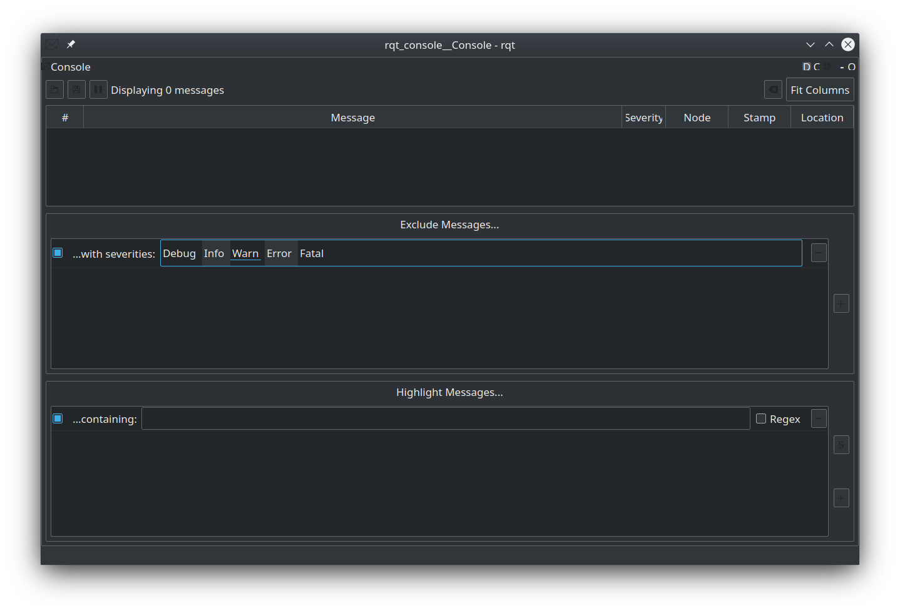
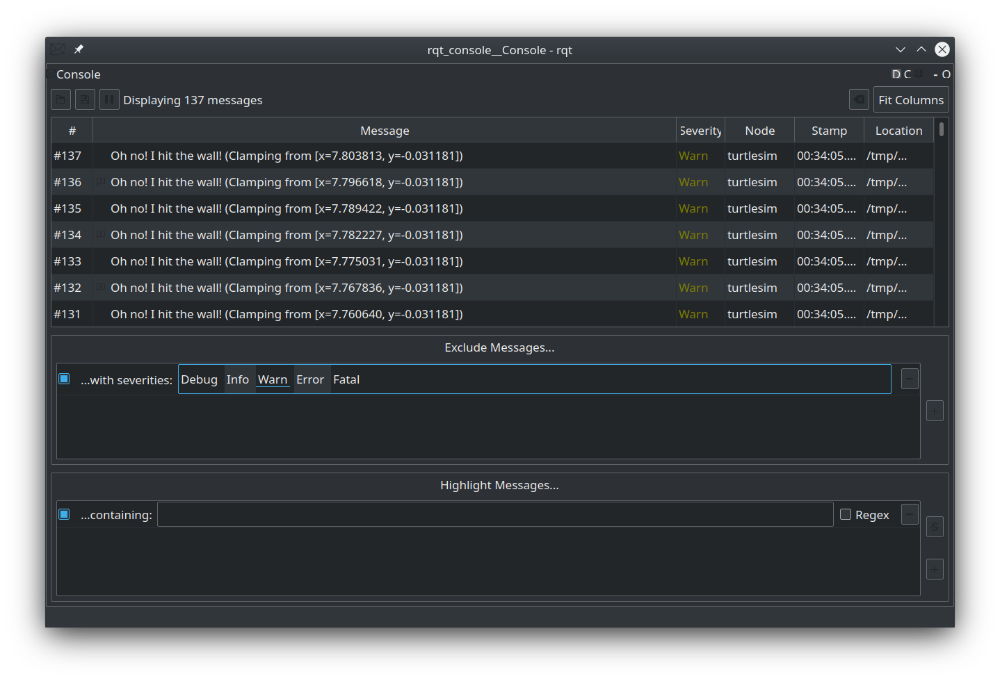

# Other Common Tools in ROS2
In this tutorial we'll cover some of the other common tools used in ROS2 development. These include the **rqt_console** plugin, **Launch files**, and the **ROS Bag System**.

## rqt_console
`rqt_console` is a GUI tool used to introspect log messages in ROS 2. Nodes use logs to output messages concerning events and statuses in a variety of ways. Their content is usually informational, for the sake of the user. The intent of a log message is defined by the author of the node, though the content may be written at runtime. 

Typically, log messages show up in your terminal. With `rqt_console`, you can collect those messages over time, view them closely and in a more organized manner, filter them, save them and even reload the saved files to introspect at a different time.

In this section, we'll view some log messages generated by `turtlesim`, you should bring up both the main node and the teleop node:
```
ros2 run turtlesim turtlesim_node
ros2 run turtlesim turtle_teleop_key
```
### Logger Levels
Before we jump into using `rqt_console` to view log messages, we'll need an understanding of *Logger Levels* in ROS2. Logger Levels are a way of organizing the output of a program into increasingly important/severe categories. This helps prevent your terminal windows from being cluttered with needless debug messages, and elevate important messages like warning and errors.

ROS2’s Logger Levels are ordered by severity:
- `Fatal` messages indicate the system is going to terminate to try to protect itself from detriment.
- `Error` messages indicate significant issues that won’t necessarily damage the system, but are preventing it from functioning properly.
- `Warn` messages indicate unexpected activity or non-ideal results that might represent a deeper issue, but don’t harm functionality outright.
- `Info` messages indicate event and status updates that serve as a visual verification that the system is running as expected.
- `Debug` messages detail the entire step-by-step process of the system execution.

The default level is `Info`. You will only see messages of the default severity level and more-severe levels. For example, if you set the default level to `Warn`, you would only see messages of severity `Warn`, `Error`, and `Fatal`.

You can set the default Logger Level by setting the node argument on launch. For example, if you wanted to launch the turtlesim node with a default Logger Level of `Warn`, you would launch the node with the following arguments (making sure you close any existing instance of the node):
```
ros2 run turtlesim turtlesim_node --ros-args --log-level WARN
```
Now you won’t see the initial `Info` level warnings that came up in the console last time you started turtlesim.

### Using rqt_console
Start `rqt_console` in a new terminal with the following command:
```
ros2 run rqt_console rqt_console
```
The `rqt_console` window will open:


The first section of the console is where log messages from your system will display.

In the middle you have the option to filter messages by excluding severity levels. You can also add more exclusion filters using the plus-sign button to the right.

The bottom section is for highlighting messages that include a string you input. You can add more filters to this section as well.

While you have `turtlesim` and `rqt_console` running, lets generate some warnings so we can get familiar with `rqt_console`. We can do this by moving our turtle over to one of the edges of the simulator window, and ramming him into it. Animal cruelty aside, this should generate some warning-level log messages:


As you can see, `rqt_console` will display the log message in its entirety, the severity level, the node it was generated in, and a timestamp. `rqt_console` also allows the developer to sort the messages by any of these parameters, making it a better solution to error tracking than the terminal window.

## Launch Files


## ROS Bag
