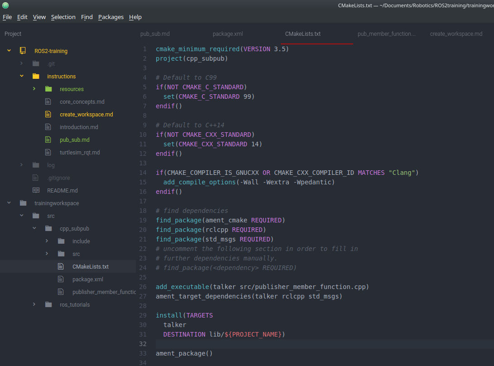

# Creating a Publisher and Subscriber
I this tutorial we will create our first Publisher and Subscriber.

## Prerequisites
Before beginning this tutorial you should have completed the [Core Concepts](https://index.ros.org/p/std_msgs/) and [Creating a Workspace](create_workspace.md) tutorials.

## Writing Nodes
Start by creating a new ROS2 package in the **dev_ws** workspace called ```cpp_pubsub```, remember to put packages in the **src** directory:
```
ros2 pkg create --build-type ament_cmake cpp_pubsub
```
After package verification navigate to ```dev_ws/src/cpp_pubsub/src```. Download the example code using the following command:
```
wget -O publisher_member_function.cpp https://raw.githubusercontent.com/ros2/examples/master/rclcpp/topics/minimal_publisher/member_function.cpp
```
List the files in the directory, you should see a file named ```publisher_member_function.cpp```. Open the file in your preferred text editor.


At the top of the file you see the packages that need to be included to write this node. __*chrono*__ and __*memory*__ are apart of the standard C++ libraries. __*rclcpp/rclcpp.hpp*__ and __*std_msgs/msg/string.hpp*__ are ROS dependencies and will be added to the **package.xml** file later in the tutorial. The ROS dependencies include the built-in message types we will use to publish data. If you would like to see a list of the message types click [here](https://index.ros.org/p/std_msgs/).

After the include statements a class created that inherits the ```rclcpp::Node``` class. The constructor for the **MinimalPublisher** class creates a **Node** object named ```minimal_publisher``` and initializes ```count_```, defined in the **private** section of the class deceleration line 47, to 0.
```
MinimalPublisher(): Node("minimal_publisher"), count_(0)
```
Inside the constructor body, the ```publisher_```,defined in the **private** section of the class deceleration line 46, variable is initialized with a **String** type and given the name **topic** and queue size limit in the case of backup:
```
publisher_ = this->create_publisher<std_msgs::msg::String>("topic", 10);
```
After the publisher initialization a timer initialized,defined in the **private** section of the class deceleration line 45. To call the ```timer_callback()``` method, defined in the **private** section of the class deceleration line 38, twice a second. Message data is sent to the ```timer_callback``` function and published from there:
``` C++
void timer_callback()
  {
    auto message = std_msgs::msg::String(); // Creates a ROS2 string to hold the message
    message.data = "Hello, world! " + std::to_string(count_++); // Increments count_ and appends it to the message data
    RCLCPP_INFO(this->get_logger(), "Publishing: '%s'", message.data.c_str()); // Ensures every message it published to the console
    publisher_->publish(message); // Publishes the message
  }
```
Following the class deceleration is the main function, where the node actually executes. ```rclcpp::init``` initializes the ROS2 and ```rclcpp::spin``` starts processing data from the node, including callbacks from the timer.

## Adding Dependencies
Navigate into back into the ```cpp_pubsub``` directory, where the ```CMakeLists.txt``` and ```package.xml``` files have been created. Open ```package.xml``` in your text editor. After the ```ament_cmake``` line add the following:
```
<depend>rclcpp</depend>
<depend>std_msgs</depend>
```
This will declare the package needs ```rclcpp``` and ```std_msgs``` to run.

After editing ```package.xml``` open the ```CMakeLists.txt``` and add the following below ``` find_package(ament_cmake REQUIRED)```:
``` CMakeLists
find_package(rclcpp REQUIRED)
find_package(std_msgs REQUIRED)
```
After adding the dependencies add the executable and name it talker so you can run your node using ```ros2 run```:
```CMakeLists
add_executable(talker src/publisher_member_function.cpp)
ament_target_dependencies(talker rclcpp std_msgs)
```
Add the install target section so ```ros2 run ``` and find your executable:
``` CMakeLists
install(TARGETS
  talker
  DESTINATION lib/${PROJECT_NAME})
```
Your ```CMakeLists.txt``` should look like this one completed:


## Writing a Subscriber
Navigate into the ```dev_ws/src/cpp_pubsub/src``` directory run the following command to get the practice files:
```
wget -O subscriber_member_function.cpp https://raw.githubusercontent.com/ros2/examples/master/rclcpp/topics/minimal_subscriber/member_function.cpp
```
Listing the files in the directory should now show:
```
publisher_member_function.cpp  subscriber_member_function.cpp
```
Open ```subscriber_member_function.cpp``` with your text editor. The subscriber's code is very similar to the publisher's code, the **Node** name is now "minimal_subscriber" and the constructor uses **Node's** __*create_subscription*__ class to execute callback. A timer is not created because the subscriber simply responds whenever data is published to the topic. The topic name and type used in the publisher and subscriber must match.
``` C++
MinimalSubscriber()
  : Node("minimal_subscriber") // Node is created and given the name "minimal_subscriber"
  {
    subscription_ = this->create_subscription<std_msgs::msg::String>(
    "topic", 10, std::bind(&MinimalSubscriber::topic_callback, this, _1)); // Subscription to topic is created
  }
```
The subscription uses the ```topic_callback``` method, defined in the private section of the declaration line 32:
``` C++
void topic_callback(const std_msgs::msg::String::SharedPtr msg) const
  {
    RCLCPP_INFO(this->get_logger(), "I heard: '%s'", msg->data.c_str()); // Outputs message to console
  }
  rclcpp::Subscription<std_msgs::msg::String>::SharedPtr subscription_; // Subscription variable definition
```
The main function is the same as the publisher, except it spins ```MinimalSubscriber``` instead of ```MinimalPublisher```. The dependencies are the same as ```MinimalPublisher``` so no changes need to be made to ```package.xml```. Reopen ```CMakeLists.txt``` and add the following lines:
``` CMakeLists
add_executable(listener src/subscriber_member_function.cpp)
ament_target_dependencies(listener rclcpp std_msgs)

install(TARGETS
  talker
  listener
  DESTINATION lib/${PROJECT_NAME})
```
Build and source the workspace then run the publisher and subscriber.
