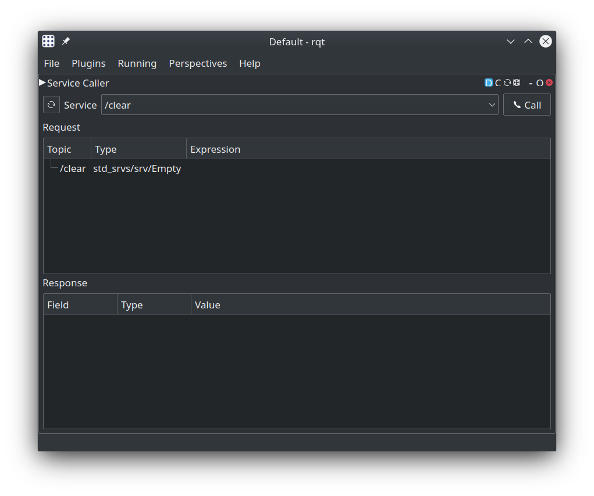
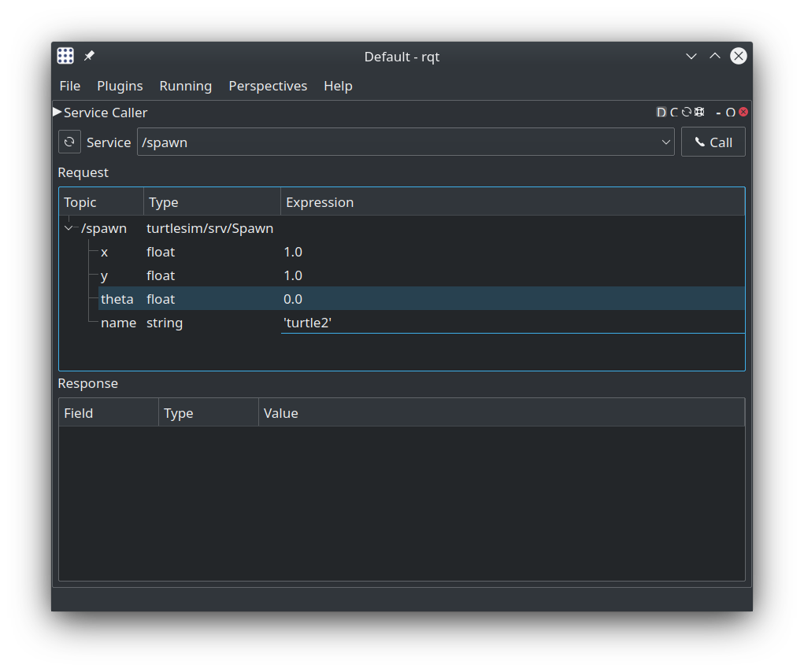
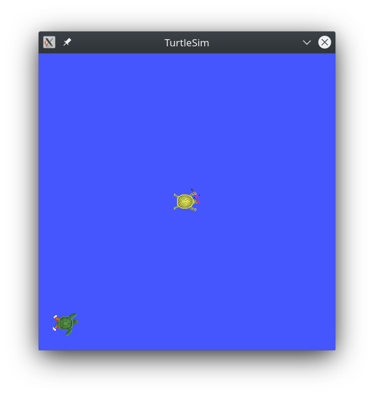
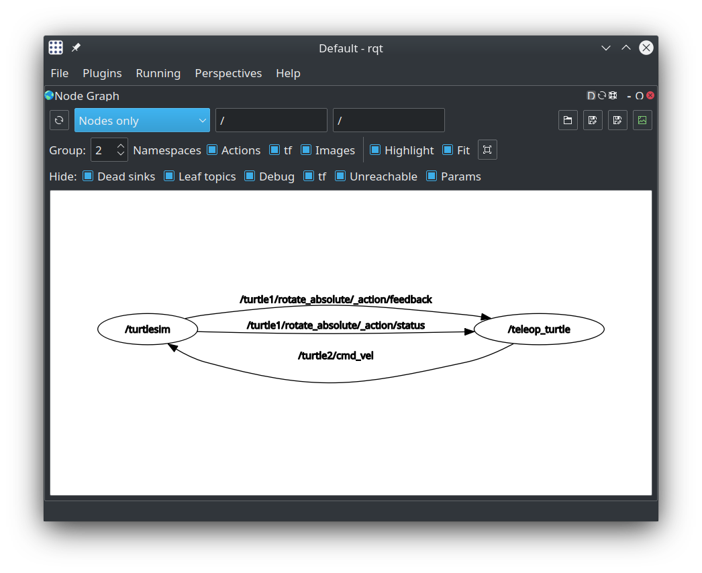

# An overview of ROS2 with turtlesim and rqt
In this tutorial, we'll touch on core ROS2 concepts and illustrate them using the 'turtlesim' simulator, a lightweight simulator for learning ROS2, and rqt, a GUI tool for interacting with an visualizing ROS2 elements.

## Prerequisites
Before we begin, lets make sure we have both turtlesim and rqt installed. Always start by sourcing your setup file (preferrably with an alias). To check if turtlesim is installed, simply run:
```
ros2 pkg executables turtlesim
```
which should return a list of turtlesim's executables
```
turtlesim draw_square
turtlesim mimic
turtlesim turtle_teleop_key
turtlesim turtlesim_node
```
And to check if rqt is installed simply try to run it:
```
rqt
```
If the previous command comes up with an error such as "command 'rqt' not found" or something similar, make sure you have it installed by executing this command:
```
sudo apt install ros-foxy-rqt
```
After that, make sure you've got at least 4 terminal windows open (with the setup file sourced of course!), we'll be using all of them shortly.

## Running turtlesim
To start turtlesim, enter the following command into one of your terminals:
```
ros2 run turtlesim turtlesim_node
```
The main simulator window should appear and a randoml turtle should be in the center!


If you look in the terminal, you'll see some handy information about the turlesim 'node' we just created such as the name of the turtle (turtle1) and it's starting coordinates:
```
[INFO] [1596657544.827801758] [turtlesim]: Starting turtlesim with node name /turtlesim
[INFO] [1596657544.830080315] [turtlesim]: Spawning turtle [turtle1] at x=[5.544445], y=[5.544445], theta=[0.000000]
```
This introduces us to the concept of a ROS2 'node' which is the core element in the structure of ROS2 systems! It facilitates comminucation with other nodes, and allows the programmer to perform operations or interact with other nodes through topics, services, or actions.

To get a better idea of what ROS2 is all about, lets start up another node! This time we'll start a node which gives us keyboard control over our turtle, otherwise known as 'teleoperation'. Go to your second terminal window and enter the command:
```
ros2 run turtlesim turtle_teleop_key
```
Now, when you have this terminal as your active window, use the arrow keys to move the turtle around.

You can see all of the **nodes**, **topics**, **services**, and **actions** that make up the turtlesim system by using the ```list``` command as such:
```
ros2 node list
ros2 topic list
ros2 service list
ros2 action list
```
As described earlier, a **node** can be thought of as one program or process running in a ROS2 system. It can execute arbitrary code, and use the **ROS2 Client Libraries** to access various ROS2 functionality. Nodes can communicate with one another using **topics**, **services**, or **actions**. 

**Topics** can be thought of as a 'channel' on which two nodes are communicating, things like the message frequency and type are static, so that both ends can communicate reliably. 

**Services** are very much like a function call in most modern programming languages (C++/Python), one node can request service from another on some particular piece of data, and be notified when that action has been completed. 

**Actions** are an advanced form of services with extra features such as **feedback** and the ability to **pre-empt** an action call.

Next, we'll use a program called ```rqt``` to graphically interact with and visualize the turtlesim system.

## Introducing rqt
As noted previously, ```rqt``` is a GUI tool to interact with and visualize ROS2 systems. It is very useful when trying to test or debug a system in development, as it nicely packages all of the command-line features of ROS2 into a GUI, as well as quickly and easily visualizing the system itself with things like ```rqt_graph```.

First we'll interact with our turtlesim simulator by executing some **service calls**. If you remember from this ```list``` command above, there we're a bunch of different services we could use to change the parameters of the simulation. One such service was called ```/spawn``` which, as the name implys, spawns a new turtle in the simulator.

To run rqt, simply enter ```rqt``` in a sourced terminal as such:
```
rqt
```
After selecting the **Service Caller** plugin from **Plugins** > **Services** > **Service Caller**, you should see the following screen:


In the dropdown menu, you can select the service you would like to call, and fill out any parameters that particular service call requires. In our case, we want to select the ```/spawn``` service, and fill out the fields as shown below:


When you hit the **call** button to the right, another turtle should appear:



Right now, we won't be able to control it, but we can start another 'teleoperation' node, and **remap** it to the new turtle. To **remap** a node simply means to change the topic on which its publishing. In this case, we want to **remap** the output of our new ```turtle_teleop_key``` node from ```turtle1/cmd_vel``` to ```turtle2/cmd_vel```, enabling it to control the turtle we just spawned:
```
ros2 run turtlesim turtle_teleop_key --ros-args --remap turtle1/cmd_vel:=turtle2/cmd_vel
```
Now, if you click on the terminal running this new teleoperation node, you should be able to move the second turtle around. Switching between the two teleop terminals will allow you to control both turtles individually!

## Using rqt_graph to visualize ROS2 systems
```rqt_graph``` is a rqt plugin which visualizes the current ROS2 system in a graph format. The graph represents all of the currently running nodes and all of the connections and interfaces between them as they send, recieve, and process data in real time. While our turtlesim simulator is running, we can start ```rqt_graph``` either by running
```
rqt_graph
```
in a sourced terminal, or by running 
```
rqt
```
in a terminal, and navigating to **Plugins** > **Introspection** > **Node Graph**. Either way, the result should be the following graph:


As you can see above, ```rqt_graph``` draws nodes as ovals or circles and topics as arrows. You should also notice that services and actions are also represented as topics, this is because in implementation, services and actions use the same messaging interface as topics, they just provide a structured interface for two nodes to interact as a server or client.

## Shutting down turtlesim
In ROS2, to shutdown a node, you can simply click on the desired terminal and perform a ```Ctrl-C```.

## Next Steps
In the next section, we'll cover [nodes, topics, services, actions, and parameters]() in more detail.